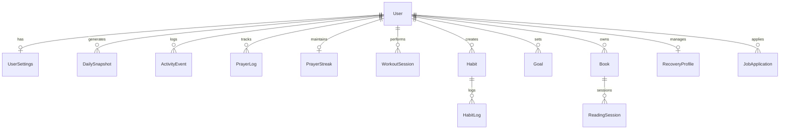

# Nafs – Database Schema

MongoDB + Mongoose. All collections include `createdAt` and `updatedAt` unless noted.

---

## Entity Relationship Overview

```
User ──┬── UserSettings
       ├── DailySnapshot (Life Score history)
       ├── ActivityEvent (unified log)
       │
       ├── Islamic ── PrayerLog, QuranProgress, QuranBookmark, AdhkarLog, PersonalDua
       ├── Fitness ── WorkoutPlan, WorkoutSession, Exercise, BodyMeasurement, ProgressPhoto
       ├── Health  ── WaterLog, MealLog, SleepLog, WalkLog
       ├── Coding  ── CodingSession, CodingProject, PomodoroSession, GitHubConnection
       ├── Reading ── Book, ReadingSession, BookNote, BookHighlight, BookWishlist
       ├── Wellness── MoodLog, JournalEntry, GratitudeEntry
       ├── Recovery── RecoveryProfile, UrgeLog, TriggerLog
       ├── Career  ── JobApplication, Interview, PortfolioItem
       ├── Goals   ── Goal, VisionBoardItem
       └── Habits  ── Habit, HabitLog, HabitCategory
```

---

## 1. Core Collections

### 1.1 `users`

```typescript
{
  _id: ObjectId,
  email: string,              // unique, indexed
  passwordHash: string,
  name: string,
  avatar?: string,            // Cloudinary URL
  role: 'user' | 'admin',     // default: 'user'
  isVerified: boolean,
  refreshToken?: string,
  location?: {
    city: string,
    country: string,
    latitude: number,
    longitude: number,
    timezone: string
  },
  onboardingCompleted: boolean,
  lastActiveAt: Date,
  createdAt: Date,
  updatedAt: Date
}
// Indexes: email (unique), role, lastActiveAt
```

### 1.2 `userSettings`

```typescript
{
  _id: ObjectId,
  userId: ObjectId,           // ref: users, unique
  theme: 'light' | 'dark' | 'system',
  language: 'en' | 'ar' | 'ml',  // English, Arabic, Malayalam
  notifications: {
    enabled: boolean,
    prayerReminders: boolean,
    mealReminders: boolean,
    habitReminders: boolean,
    streakAlerts: boolean,
    quietHoursStart?: string,   // "22:00"
    quietHoursEnd?: string      // "06:00"
  },
  privacy: {
    showOnLeaderboard: boolean,
    dataSharing: boolean
  },
  modules: {                  // Enable/disable modules
    islamic: boolean,
    fitness: boolean,
    health: boolean,
    coding: boolean,
    reading: boolean,
    wellness: boolean,
    recovery: boolean,
    career: boolean
  },
  lifeScoreWeights?: Record<string, number>,  // Custom weight overrides
  calculationMethod: string,  // madhab for prayer times
  createdAt: Date,
  updatedAt: Date
}
// Index: userId (unique)
```

### 1.3 `dailySnapshots`

Powers Life Score history and dashboard trends.

```typescript
{
  _id: ObjectId,
  userId: ObjectId,
  date: Date,                 // normalized to midnight UTC, indexed
  lifeScore: number,          // 0-100
  moduleScores: {
    islamic: number,
    fitness: number,
    health: number,
    habits: number,
    goals: number,
    wellness: number,
    growth: number,           // coding + reading
    recovery?: number
  },
  streaks: {
    overall: number,
    prayer: number,
    habits: number,
    reading: number,
    recovery?: number
  },
  completedGoals: number,
  totalGoals: number,
  metadata: Record<string, unknown>,
  createdAt: Date
}
// Compound index: { userId: 1, date: -1 } unique
```

### 1.4 `activityEvents`

Unified event stream for analytics heatmaps and reports.

```typescript
{
  _id: ObjectId,
  userId: ObjectId,
  module: string,             // 'islamic' | 'fitness' | 'health' | ...
  action: string,             // 'prayer_completed' | 'workout_logged' | ...
  metadata: Record<string, unknown>,
  scoreImpact: number,        // points contributed to Life Score
  timestamp: Date,
  createdAt: Date
}
// Indexes: { userId: 1, timestamp: -1 }, { userId: 1, module: 1, timestamp: -1 }
```

---

## 2. Islamic Hub

### 2.1 `prayerLogs`

```typescript
{
  _id: ObjectId,
  userId: ObjectId,
  date: Date,                 // prayer date (normalized)
  prayers: {
    fajr: { completed: boolean, onTime: boolean, completedAt?: Date },
    dhuhr: { completed: boolean, onTime: boolean, completedAt?: Date },
    asr: { completed: boolean, onTime: boolean, completedAt?: Date },
    maghrib: { completed: boolean, onTime: boolean, completedAt?: Date },
    isha: { completed: boolean, onTime: boolean, completedAt?: Date }
  },
  score: number,              // daily prayer score 0-100
  createdAt: Date,
  updatedAt: Date
}
// Compound index: { userId: 1, date: -1 } unique
```

### 2.2 `prayerStreaks`

```typescript
{
  _id: ObjectId,
  userId: ObjectId,           // unique
  currentStreak: number,
  longestStreak: number,
  lastCompletedDate: Date,
  totalPrayersCompleted: number,
  updatedAt: Date
}
```

### 2.3 `quranProgress`

```typescript
{
  _id: ObjectId,
  userId: ObjectId,
  surahNumber: number,        // 1-114
  ayahFrom?: number,
  ayahTo?: number,
  juzNumber?: number,         // 1-30
  pagesRead: number,
  minutesSpent: number,
  date: Date,
  notes?: string,
  createdAt: Date
}
// Index: { userId: 1, date: -1 }
```

### 2.4 `quranBookmarks`

```typescript
{
  _id: ObjectId,
  userId: ObjectId,
  surahNumber: number,
  ayahNumber: number,
  label?: string,
  note?: string,
  createdAt: Date
}
```

### 2.5 `quranTracker`

Overall Quran reading state per user.

```typescript
{
  _id: ObjectId,
  userId: ObjectId,           // unique
  juzCompleted: number[],     // [1, 2, 5, ...]
  surahsCompleted: number[],
  totalPagesRead: number,
  dailyGoalPages: number,
  currentStreak: number,
  longestStreak: number,
  lastReadDate?: Date,
  updatedAt: Date
}
```

### 2.6 `adhkarLogs`

```typescript
{
  _id: ObjectId,
  userId: ObjectId,
  type: 'morning' | 'evening',
  date: Date,
  completed: boolean,
  itemsCompleted: number,
  totalItems: number,
  completedAt?: Date,
  createdAt: Date
}
```

### 2.7 `personalDuas`

```typescript
{
  _id: ObjectId,
  userId: ObjectId,
  title: string,
  arabicText?: string,
  transliteration?: string,
  translation?: string,
  category?: string,
  isFavorite: boolean,
  createdAt: Date,
  updatedAt: Date
}
```

### 2.8 `islamicReminders`

```typescript
{
  _id: ObjectId,
  userId: ObjectId,
  type: 'prayer' | 'quran' | 'adhkar' | 'custom',
  title: string,
  time: string,               // "05:30"
  days: number[],             // 0=Sun, 6=Sat
  enabled: boolean,
  createdAt: Date,
  updatedAt: Date
}
```

---

## 3. Gym & Fitness

### 3.1 `exercises`

Global + user custom exercises.

```typescript
{
  _id: ObjectId,
  userId?: ObjectId,          // null = system exercise
  name: string,
  muscleGroup: string,        // 'chest' | 'back' | 'legs' | ...
  equipment?: string,
  instructions?: string,
  imageUrl?: string,
  isCustom: boolean,
  createdAt: Date
}
// Index: muscleGroup, text search on name
```

### 3.2 `workoutPlans`

Weekly split template.

```typescript
{
  _id: ObjectId,
  userId: ObjectId,
  name: string,
  schedule: [{
    day: 'monday' | 'tuesday' | ... | 'sunday',
    focus: string,            // 'Push', 'Pull', 'Legs'
    exercises: [{
      exerciseId: ObjectId,
      sets: number,
      reps: string,           // "8-12" or "10"
      restSeconds: number,
      notes?: string
    }]
  }],
  isActive: boolean,
  createdAt: Date,
  updatedAt: Date
}
```

### 3.3 `workoutSessions`

```typescript
{
  _id: ObjectId,
  userId: ObjectId,
  planId?: ObjectId,
  date: Date,
  duration: number,           // minutes
  exercises: [{
    exerciseId: ObjectId,
    name: string,
    sets: [{
      reps: number,
      weight: number,         // kg or lbs based on user pref
      completed: boolean
    }]
  }],
  notes?: string,
  rating?: number,            // 1-5
  createdAt: Date
}
// Index: { userId: 1, date: -1 }
```

### 3.4 `personalRecords`

```typescript
{
  _id: ObjectId,
  userId: ObjectId,
  exerciseId: ObjectId,
  exerciseName: string,
  weight: number,
  reps: number,
  oneRepMax?: number,
  achievedAt: Date,
  createdAt: Date
}
// Index: { userId: 1, exerciseId: 1 }
```

### 3.5 `bodyMeasurements`

```typescript
{
  _id: ObjectId,
  userId: ObjectId,
  date: Date,
  weight?: number,
  bodyFat?: number,
  chest?: number,
  waist?: number,
  hips?: number,
  arms?: number,
  thighs?: number,
  unit: 'metric' | 'imperial',
  createdAt: Date
}
```

### 3.6 `progressPhotos`

```typescript
{
  _id: ObjectId,
  userId: ObjectId,
  cloudinaryId: string,
  url: string,
  date: Date,
  category: 'front' | 'side' | 'back',
  notes?: string,
  createdAt: Date
}
```

---

## 4. Health Trackers

### 4.1 `waterLogs`

```typescript
{
  _id: ObjectId,
  userId: ObjectId,
  date: Date,
  entries: [{
    amount: number,           // ml
    timestamp: Date
  }],
  dailyGoal: number,          // ml, default 2500
  totalAmount: number,
  createdAt: Date,
  updatedAt: Date
}
// Compound index: { userId: 1, date: -1 } unique
```

### 4.2 `mealLogs`

```typescript
{
  _id: ObjectId,
  userId: ObjectId,
  date: Date,
  meals: [{
    type: 'breakfast' | 'lunch' | 'dinner' | 'snack',
    name: string,
    calories: number,
    protein: number,          // grams
    carbs: number,
    fats: number,
    time?: string,
    notes?: string
  }],
  dailyTotals: {
    calories: number,
    protein: number,
    carbs: number,
    fats: number
  },
  dailyGoals: {
    calories: number,
    protein: number,
    carbs: number,
    fats: number
  },
  createdAt: Date,
  updatedAt: Date
}
```

### 4.3 `sleepLogs`

```typescript
{
  _id: ObjectId,
  userId: ObjectId,
  date: Date,                 // date of waking up
  bedTime: Date,
  wakeTime: Date,
  duration: number,           // minutes
  quality: 1 | 2 | 3 | 4 | 5,
  notes?: string,
  createdAt: Date
}
```

### 4.4 `walkLogs`

```typescript
{
  _id: ObjectId,
  userId: ObjectId,
  date: Date,
  steps: number,
  distance?: number,          // km
  duration?: number,          // minutes
  calories?: number,
  dailyGoal: number,          // default 10000 steps
  createdAt: Date,
  updatedAt: Date
}
```

---

## 5. Coding Tracker

### 5.1 `codingSessions`

```typescript
{
  _id: ObjectId,
  userId: ObjectId,
  projectId?: ObjectId,
  date: Date,
  startTime: Date,
  endTime: Date,
  duration: number,           // minutes
  language?: string,
  description?: string,
  createdAt: Date
}
```

### 5.2 `codingProjects`

```typescript
{
  _id: ObjectId,
  userId: ObjectId,
  name: string,
  description?: string,
  repoUrl?: string,
  language: string,
  status: 'active' | 'paused' | 'completed',
  totalHours: number,
  roadmap: [{
    title: string,
    completed: boolean,
    order: number
  }],
  createdAt: Date,
  updatedAt: Date
}
```

### 5.3 `pomodoroSessions`

```typescript
{
  _id: ObjectId,
  userId: ObjectId,
  projectId?: ObjectId,
  date: Date,
  workMinutes: number,
  breakMinutes: number,
  cyclesCompleted: number,
  createdAt: Date
}
```

### 5.4 `githubConnections`

```typescript
{
  _id: ObjectId,
  userId: ObjectId,           // unique
  githubUsername: string,
  accessToken: string,        // encrypted
  avatarUrl?: string,
  stats: {
    totalCommits: number,
    currentStreak: number,
    longestStreak: number,
    lastFetchedAt: Date
  },
  updatedAt: Date
}
```

---

## 6. Reading & Books

### 6.1 `books`

User's library (currently reading, finished, etc.).

```typescript
{
  _id: ObjectId,
  userId: ObjectId,
  title: string,
  author: string,
  isbn?: string,
  coverUrl?: string,
  category: 'programming' | 'islamic' | 'self-improvement' | 'business' | 'biography' | 'malayalam' | 'english',
  totalPages: number,
  currentPage: number,
  status: 'reading' | 'completed' | 'paused' | 'wishlist',
  startedAt?: Date,
  completedAt?: Date,
  rating?: number,
  externalIds: {
    googleBooksId?: string,
    openLibraryId?: string
  },
  createdAt: Date,
  updatedAt: Date
}
```

### 6.2 `readingSessions`

```typescript
{
  _id: ObjectId,
  userId: ObjectId,
  bookId: ObjectId,
  date: Date,
  pagesRead: number,
  duration: number,           // minutes
  startPage: number,
  endPage: number,
  createdAt: Date
}
```

### 6.3 `bookNotes`

```typescript
{
  _id: ObjectId,
  userId: ObjectId,
  bookId: ObjectId,
  page?: number,
  content: string,
  createdAt: Date,
  updatedAt: Date
}
```

### 6.4 `bookHighlights`

```typescript
{
  _id: ObjectId,
  userId: ObjectId,
  bookId: ObjectId,
  page: number,
  text: string,
  color?: string,
  createdAt: Date
}
```

### 6.5 `readingStreaks`

```typescript
{
  _id: ObjectId,
  userId: ObjectId,           // unique
  currentStreak: number,
  longestStreak: number,
  lastReadDate?: Date,
  totalPagesRead: number,
  totalMinutesRead: number,
  updatedAt: Date
}
```

---

## 7. Mental Wellness

### 7.1 `moodLogs`

```typescript
{
  _id: ObjectId,
  userId: ObjectId,
  date: Date,
  mood: 1 | 2 | 3 | 4 | 5,   // 1=very low, 5=excellent
  emotions: string[],         // ['anxious', 'grateful', 'tired']
  notes?: string,
  createdAt: Date
}
```

### 7.2 `journalEntries`

```typescript
{
  _id: ObjectId,
  userId: ObjectId,
  date: Date,
  title?: string,
  content: string,            // rich text / markdown
  mood?: number,
  tags: string[],
  isPrivate: boolean,
  createdAt: Date,
  updatedAt: Date
}
```

### 7.3 `gratitudeEntries`

```typescript
{
  _id: ObjectId,
  userId: ObjectId,
  date: Date,
  items: string[],            // up to 5 gratitude items
  createdAt: Date
}
```

---

## 8. Self Respect

### 8.1 `affirmationLogs`

```typescript
{
  _id: ObjectId,
  userId: ObjectId,
  date: Date,
  affirmation: string,
  completed: boolean,
  createdAt: Date
}
```

### 8.2 `confidenceChallenges`

```typescript
{
  _id: ObjectId,
  userId: ObjectId,
  title: string,
  description: string,
  difficulty: 'easy' | 'medium' | 'hard',
  completed: boolean,
  completedAt?: Date,
  dueDate?: Date,
  createdAt: Date
}
```

### 8.3 `disciplineLogs`

```typescript
{
  _id: ObjectId,
  userId: ObjectId,
  date: Date,
  category: string,
  action: string,
  completed: boolean,
  createdAt: Date
}
```

---

## 9. Addiction Recovery

### 9.1 `recoveryProfiles`

```typescript
{
  _id: ObjectId,
  userId: ObjectId,           // unique
  startDate: Date,
  currentStreak: number,
  longestStreak: number,
  lastRelapseDate?: Date,
  emergencyContacts: [{
    name: string,
    phone?: string,
    relationship: string
  }],
  motivationalQuotes: string[],
  enabled: boolean,
  updatedAt: Date
}
```

### 9.2 `urgeLogs`

```typescript
{
  _id: ObjectId,
  userId: ObjectId,
  timestamp: Date,
  intensity: 1 | 2 | 3 | 4 | 5,
  resisted: boolean,
  copingStrategy?: string,
  notes?: string,
  createdAt: Date
}
```

### 9.3 `triggerLogs`

```typescript
{
  _id: ObjectId,
  userId: ObjectId,
  timestamp: Date,
  trigger: string,
  category: 'emotional' | 'environmental' | 'social' | 'physical' | 'other',
  notes?: string,
  createdAt: Date
}
```

---

## 10. Career Hub

### 10.1 `jobApplications`

```typescript
{
  _id: ObjectId,
  userId: ObjectId,
  company: string,
  role: string,
  status: 'wishlist' | 'applied' | 'interview' | 'offer' | 'rejected' | 'accepted',
  appliedDate?: Date,
  jobUrl?: string,
  salary?: string,
  location?: string,
  notes?: string,
  resumeVersion?: string,
  createdAt: Date,
  updatedAt: Date
}
```

### 10.2 `interviews`

```typescript
{
  _id: ObjectId,
  userId: ObjectId,
  applicationId: ObjectId,
  date: Date,
  type: 'phone' | 'video' | 'onsite' | 'technical' | 'hr',
  interviewer?: string,
  feedback?: string,
  rating?: number,
  outcome?: 'passed' | 'failed' | 'pending',
  createdAt: Date
}
```

### 10.3 `portfolioItems`

```typescript
{
  _id: ObjectId,
  userId: ObjectId,
  title: string,
  description: string,
  url?: string,
  imageUrl?: string,
  technologies: string[],
  featured: boolean,
  createdAt: Date,
  updatedAt: Date
}
```

---

## 11. Goals

### 11.1 `goals`

```typescript
{
  _id: ObjectId,
  userId: ObjectId,
  title: string,
  description?: string,
  type: 'daily' | 'weekly' | 'monthly' | 'yearly' | 'lifetime',
  category?: string,
  targetValue?: number,
  currentValue: number,
  unit?: string,              // 'pages', 'hours', 'kg', etc.
  startDate: Date,
  endDate?: Date,
  status: 'active' | 'completed' | 'paused' | 'abandoned',
  priority: 'low' | 'medium' | 'high',
  milestones: [{
    title: string,
    completed: boolean,
    completedAt?: Date
  }],
  createdAt: Date,
  updatedAt: Date
}
// Index: { userId: 1, type: 1, status: 1 }
```

### 11.2 `visionBoardItems`

```typescript
{
  _id: ObjectId,
  userId: ObjectId,
  title: string,
  imageUrl?: string,
  cloudinaryId?: string,
  category?: string,
  position: { x: number, y: number },
  createdAt: Date,
  updatedAt: Date
}
```

---

## 12. Habits

### 12.1 `habitCategories`

```typescript
{
  _id: ObjectId,
  userId: ObjectId,
  name: string,
  icon: string,
  color: string,
  order: number,
  createdAt: Date
}
```

### 12.2 `habits`

```typescript
{
  _id: ObjectId,
  userId: ObjectId,
  categoryId?: ObjectId,
  name: string,
  description?: string,
  icon: string,
  color: string,
  frequency: {
    type: 'daily' | 'weekly' | 'custom',
    daysOfWeek?: number[],    // 0-6
    timesPerWeek?: number,
    customInterval?: number   // every N days
  },
  reminder?: {
    enabled: boolean,
    time: string
  },
  currentStreak: number,
  longestStreak: number,
  totalCompletions: number,
  isArchived: boolean,
  createdAt: Date,
  updatedAt: Date
}
```

### 12.3 `habitLogs`

```typescript
{
  _id: ObjectId,
  userId: ObjectId,
  habitId: ObjectId,
  date: Date,
  completed: boolean,
  value?: number,             // for quantifiable habits
  notes?: string,
  completedAt?: Date,
  createdAt: Date
}
// Compound index: { userId: 1, habitId: 1, date: -1 }
```

---

## 13. Admin

### 13.1 `adminContent`

CMS for duas, affirmations, quotes, adhkar templates.

```typescript
{
  _id: ObjectId,
  type: 'dua' | 'affirmation' | 'quote' | 'adhkar' | 'challenge',
  title: string,
  content: string,
  arabicText?: string,
  category?: string,
  isActive: boolean,
  createdBy: ObjectId,
  createdAt: Date,
  updatedAt: Date
}
```

### 13.2 `apiUsageLogs`

```typescript
{
  _id: ObjectId,
  apiName: string,
  endpoint: string,
  userId?: ObjectId,
  responseTime: number,
  statusCode: number,
  timestamp: Date
}
```

---

## 14. Cached External Data

### 14.1 `cachedApiResponses`

```typescript
{
  _id: ObjectId,
  cacheKey: string,           // unique
  apiName: string,
  data: Mixed,
  expiresAt: Date,
  createdAt: Date
}
// TTL index on expiresAt
```

---

## Index Strategy Summary

| Collection | Index | Type |
|------------|-------|------|
| users | email | unique |
| dailySnapshots | userId + date | unique compound |
| prayerLogs | userId + date | unique compound |
| habitLogs | userId + habitId + date | compound |
| activityEvents | userId + timestamp | compound |
| goals | userId + type + status | compound |
| books | userId + status | compound |
| All user-scoped | userId | single |

---

## Data Relationships Diagram


